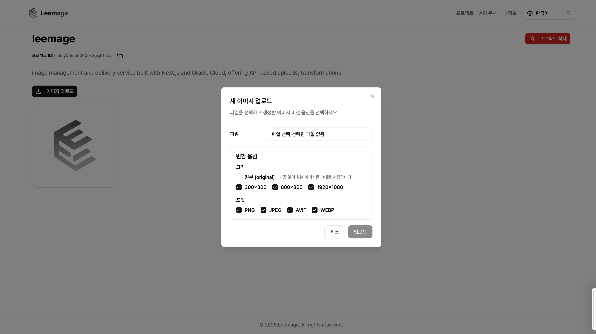
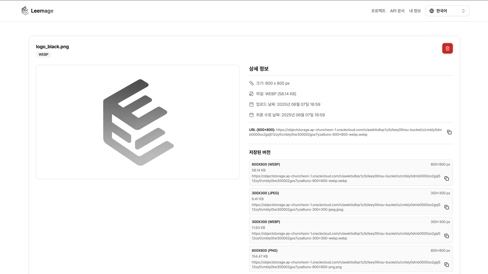

<h1 align="center">
  <strong>Leemage</strong>
</h1>

<p align="center">
  <strong>다양한 클라우드 스토리지(OCI Object Storage, Cloudflare R2)를 활용한 파일 관리 플랫폼</strong>
</p>

<p align="center">
  <a href="LICENSE"></a>
  
  <a href="https://www.npmjs.com/package/leemage-sdk"></a>
</p>

<p align="center">
  <a href="#quick-start">Quick Start</a> •
  <a href="#주요-기능">주요 기능</a> •
  <a href="#api-문서">API 문서</a> •
  <a href="https://leemage.leey00nsu.com">데모</a>
</p>

<p align="center">
  
</p>

<p align="center">
  
</p>

<p align="center">
  
</p>

---

## 목차

- [Quick Start](#quick-start)
- [주요 기능](#주요-기능)
- [기술 스택](#기술-스택)
- [설치 및 설정](#설치-및-설정)
- [API 문서](#api-문서)
- [프로젝트 구조](#프로젝트-구조)
- [브랜딩 에셋](#브랜딩-에셋)
- [테스트](#테스트)
- [기여하기](#기여하기)
- [라이선스](#라이선스)

## Quick Start

```bash
# 1. 저장소 복제 및 의존성 설치
git clone <repository_url> && cd leemage && npm install

# 2. 환경 변수 설정
cp .env.example .env  # 환경 변수 편집

# 3. 데이터베이스 및 서버 시작
docker compose up -d && npx prisma migrate dev && npm run dev
```

→ [http://localhost:3000](http://localhost:3000)에서 확인

## 주요 기능

### 🔐 사용자 관리

- iron-session 기반 세션 관리
- 환경변수 기반 루트 계정 인증

### 📁 프로젝트 관리

- 프로젝트 단위 파일 관리
- 프로젝트별 스토리지 프로바이더 선택 (OCI / R2)

### 🖼️ 파일 관리

- Presigned URL 업로드 (서버 부하 감소)
- 이미지 자동 변환 (리사이징, 포맷 변환)
- 모든 파일 타입 업로드 지원

### 🔗 API 통합

- RESTful API 및 자동 생성 OpenAPI 문서
- API 키 기반 인증
- TypeScript SDK (`leemage-sdk`)

### 🌐 국제화 (i18n)

- next-intl 기반 다국어 지원 (한국어, 영어)

## 기술 스택

| 영역           | 기술                              |
| -------------- | --------------------------------- |
| **Framework**  | Next.js 16 (App Router)           |
| **Language**   | TypeScript                        |
| **Styling**    | Tailwind CSS, Shadcn/ui           |
| **State**      | TanStack Query                    |
| **Animation**  | Motion (Framer Motion)            |
| **Database**   | PostgreSQL, Prisma                |
| **Auth**       | iron-session                      |
| **Validation** | Zod                               |
| **Image**      | Sharp                             |
| **Storage**    | OCI Object Storage, Cloudflare R2 |
| **Test**       | Vitest                            |
| **DevOps**     | Docker, Husky                     |

## 설치 및 설정

### 사전 요구사항

- Node.js v22.0.0 이상
- Docker v20.0.0 이상
- OCI 또는 Cloudflare R2 계정

### 환경 변수

`.env.example`을 복사하여 `.env` 파일을 생성하세요:

```bash
cp .env.example .env
```

각 변수에 대한 상세 설명과 설정 방법은 [.env.example](.env.example) 파일을 참조하세요.

### 비밀번호 해시 생성

```bash
npm run root:hash
```

### 실행

```bash
# 데이터베이스 시작
docker compose up -d

# 마이그레이션
npx prisma migrate dev

# 개발 서버
npm run dev
```

## API 문서

### 인증

모든 API 요청에 API 키가 필요합니다:

```http
Authorization: Bearer <YOUR_API_KEY>
```

### OpenAPI 문서

- **웹 UI**: `/api-docs` 페이지
- **YAML**: `/api/v1/openapi`

### TypeScript SDK

```bash
npm install leemage-sdk
```

```typescript
import { LeemageClient } from "leemage-sdk";

const client = new LeemageClient({ apiKey: "your-api-key" });

// 프로젝트 목록
const projects = await client.projects.list();

// 파일 업로드 (presign → upload → confirm 자동 처리)
const file = await client.files.upload(projectId, fileInput, {
  variants: [
    { sizeLabel: "max800", format: "webp" },
    { sizeLabel: "1200x800", format: "avif" },
  ],
});
```

자세한 사용법: [packages/sdk/README.md](packages/sdk/README.md)

## 프로젝트 구조

**Feature-Sliced Design (FSD)** 아키텍처를 따릅니다.

```
leemage/
├── app/             # Next.js App Router (페이지, API)
├── features/        # 기능별 모듈 (인증, 업로드 등)
├── entities/        # 비즈니스 엔티티 (Project, File 등)
├── shared/          # 공통 컴포넌트/유틸리티
├── widgets/         # 독립적인 UI 블록
├── lib/             # 서버사이드 로직
├── packages/sdk/    # TypeScript SDK (npm 배포)
├── tests/           # 테스트 코드
└── prisma/          # 데이터베이스 스키마
```

의존성 규칙: `app` → `widgets` → `features` → `entities` → `shared`

## 브랜딩 에셋

- 기본 로고 원본: `public/cloudy.png`
- 파비콘: `app/favicon.ico` (로고 원본 기반)
- UI에서 로고를 표시할 때는 `shared/ui/app/app-logo.tsx`를 공통 사용

## 테스트

```bash
# 테스트 실행
npm run test

# 워치 모드
npm run test:watch
```

테스트 구조:

- `tests/lib/` - 서버사이드 유닛 테스트
- `tests/sdk/` - SDK 테스트
- `tests/e2e/` - E2E 테스트

## 기여하기

1. Fork → 브랜치 생성 → 개발 → Pull Request

## 문제 해결

<details>
<summary><strong>데이터베이스 연결 오류</strong></summary>

```bash
docker compose ps      # 상태 확인
docker compose restart postgres  # 재시작
```

</details>

<details>
<summary><strong>OCI 연결 실패</strong></summary>

- OCI 인증 정보 확인
- 버킷 권한 설정 확인
- Private Key 경로 확인

</details>

<details>
<summary><strong>세션 오류</strong></summary>

- `IRON_SESSION_PASSWORD`가 32자 이상인지 확인

</details>

## 라이선스

[MIT License](LICENSE)

---
